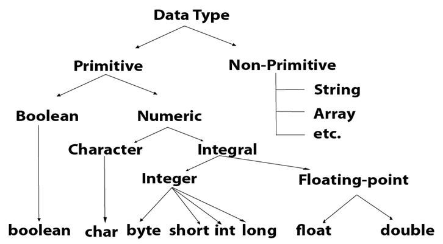
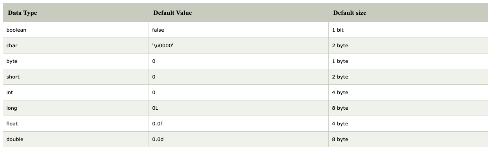

# Data Types and Variables - Main

---

## 2.1 Literals

---

- __(*) Data types and variables.__
- __(1) What is a literal?__

- (1) Any data that is entered directly into the code.
    - Can be a string or a numeric.

---

## 2.2 Variables

---

- __(*) Data types and variables.__
- __(1) What is a variable?__
- __(2) What is a variable assignment?__

- (1) A container for data.
- (2) The binding of data to a variable name.

---

## 2.3 Data Types

---

- __(*) Data types and variables.__
- __(1) What is a data type?__

<!---->

- __(External source)__
- __(2) What is a variable identifier?__

- (1)
    - Book def: A type is a way to tie together the data of a program to the actual storage details of such data.
    - My def: The storage details of the data.
    - Another def: Data types specify the different sizes and values that can be stored in the variable.
- (2)
    - The name given to a variable.
    - A variable has a identifier and a data type.

---

- Additional sources:
    - https://www.javatpoint.com/java-data-types
    - https://www.w3schools.com/java/java_data_types.asp

<!---->

- __(*) Data types and variables.__
- __(1) What are the two types of data types in Java?__
- __(2) And what data types are included in these two types?__
- __(+) Data types - Diagram.__
- __(+) Data types - Table.__

- (1) & (2)
    - Primitive data types:
        - Int
        - Short
        - Long
        - Float
        - Double
        - Boolean
        - Char
        - Byte
    - Non-primitive data types:
        - Classes
        - Interfaces
        - Arrays

<!---->

- From https://www.w3schools.com/java/java_data_types.asp
    - Primitive data types - includes `byte`, `short`, `int`, `long`, `float`, `double`, `boolean` and `char`.
    - Non-primitive data types - such as String, Arrays and Classes.

<!---->

- 
- 

---

- __(*) Data types and variables.__
- __(1) What does the `+` operator mean?__

- (1) Either addition or concatenation, depending on the data type it is working on.

---