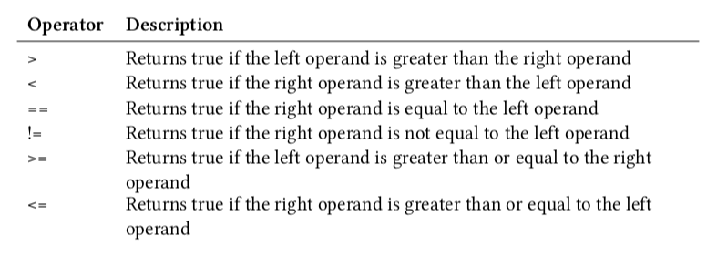

# Conditional Statements - Main

---

## 4.1 Comparison Operators

---

- __(*) Conditional statements.__
- __(1) List and detail 6 operators.__

<details>

- (1)
    - 

</details>

---

## 4.2 If-Else Conditional

---

- __(*) Conditional statements.__
- __(1) If-else-if-else statement.__
- __(2) Notes.__

<details>

- (1)

```java
if (condition1) {
    // ...
} else if (condition2) {
    // ...
} else {
    // ...
}
```

- (2)
    - The `else` is optional.
    - The curly braces, signifying a code block, can be omitted if there is only one statement to execute.

</details>

---

## 4.3 Switch Conditionals

---

- __(*) Conditional statements.__
- __(1) Switch statement.__
- __(2) Notes.__
- __(2) Notes from other sources.__

<details>

- (1)

```java
switch (choice) {
    case case1:
        // ...
        break;
        
    case case2:
        // ...
        break;
        
    case case3:
        // ...
        break;

    default:
        // ...
}
```

- (2)
    - Notice the use of `break` after each `case`, but not `default`.
    - `break` causes the execution to jump to the end of the switch.
    - `break` is optional. If absent the execution will continue to the next `case` until a `break` is encountered or until the execution reaches the end of the switch.
    - The `default` statement executes if no match is encountered.
    - The `choice` can be:
        - A character
        - An integer
        - A String object (since Java 7)

<!---->

- (3)
    - From https://www.javatpoint.com/java-switch
        - The case value must be literal or constant. It doesn't allow variables.
        - The Java switch expression (/choice) must be of `byte`, `short`, `int`, `long` (with its Wrapper type), `enums` and `string`.
            - So no `booleans`, `floats`, `doubles`.


</details>

---