# Big O - Main

---

- (*) Big O.
- (1) What is the purpose of Big O?

<details>

- (1)
    - To describe the efficiency of algorithms.
    - It describes the rate of increase (of time or space (as the problem gets larger)).

</details>

---

## An Analogy

---

- No notes.

---

## Time Complexity

---

- (*) Big O - Time Complexity.
- (1) What is another name for "big O time"? And what does this mean?

<details>

- (1) Asymptotic runtime.
    - Asymptotic analysis: Method of describing limiting behaviour.

</details>

---

- (*) Big O - Time Complexity.
- (1) What is the time complexity of transferring a file via:
    - (a) electronic transfer.
    - (b) airplane transfer.
- (2) Plot a graph of how the previous two time complexities interact.

<details>

- (1)
    - (a) `O(s)` where `s` is the size of the file.
    - (b) `O(1)` with respect to the size of the file.
- (2)
    - 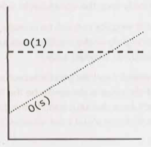

</details>

---

- (*) Big O - Time Complexity.
- (1) What are some of the common time complexities (runtimes)?
- (2) Can you have multiple variables in the time complexity?
- (3) Example of painting a wall?

<details>

- (1)
    - `O(log N)`
    - `O(N log N)`
    - `O(N)`
    - `O(N^2)`
    - `O(2^N)`
- (2) Yes.
- (3) `O(whp)` where:
    - `w` - width
    - `h` - height
    - `p` - layers

</details>

---

### Big 0, Big Theta, and Big Omega

---

- Skipped.

---

### Best Case, Worst Case, and Expected Case

---

- (*) Big O - Time Complexity.
- (1) What are three ways the time complexity (runtime) of an algorithm can be described?
- (2) Which of the two are more useful?
- (3) What is often the case with these two.

<details>

- (1)
    - Best case.
    - Worst case.
    - Expected case.
- (2)
    - Worst and expected.
- (3)
    - Often, the worst and the expected time complexity is the same.

</details>

---

## Space Complexity

---

- (*) Big O - Space Complexity.
- (1) Another word for space?
- (2) Space complexity: Need to create an array of size N?
- (3) Space complexity: Need to create a matrix of size NxN?

<details>

- (1) Memory.
- (2) `O(N)`
- (3) `O(N^2)`

</details>

---

- (*) Big O - Space Complexity.
- (1) In a recursive function, what memory needs to be taken into account?
- (2) What is the space complexity of the following method?

```java
int sum(int n) {
    if (n <= 0) return 0;
    return n + sum(n-1);
}
```

<details>

- (1) Stack space. (/Call stack)
- (2) `O(N)` (and `O(N)` time)

</details>

---

- (*) Big O - Space Complexity.
- (1) What is the space complexity of the following:

```java
int pairSumSequence(int n) {
    int sum = 0;
    for (int i = 0; i < n; i++) {
        sum += pairSum(i, i + 1);
    }
    return sum;
}

int pairSum(int a, int b) {
    return a + b;
}
```

<details>

- (1) `O(1)`
    - There will be roughly `O(n)` calls to `pairSum()`.
    - However, these calls do not exist simultaneously on the call stack.

</details>

---

## Drop the Constants

---

- (*) Big O - Drop the Constants.
- (1) Why do we drop the constants for Big O.
- (2) If you want to keep the constants and get precise about it, what would you need to do?
- (3) Why would you not want to do this?

<details>

- (1)
    - Because Big O describes the rate of increase.
    - The constants don't make a difference.
- (2)
    - You would need to go to the assembly level and count the number of instructions.
    - For example, multiplication takes more instructions than addition.
- (3) It would be very complicated.

</details>

---

## Drop the Non-Dominant Terms

---

- (*) Big O - Drop the Non-Dominant Terms.
- (1) What does the time complexity of `O(N^2 + N^2)` reduce to?
- (2) What do you do with non-dominant terms?
- (3) What do the following time complexities reduce to?
    - (a) `O(N^2 + N)`
    - (a) `O(N + log N)`
    - (a) `O(5 * 2^N + 1000N^100)`
- (4) When might you have a sum in a time complexity?

<details>

- (1) `O(2N^2)` -> `O(N^2)`
- (2) Drop them.
- (3)
    - (a) `O(N^2)`
    - (a) `O(N)`
    - (a) `O(2^N)`
- (4)
    - When there are more than one variables.
    - E.g. `O(B^2 + A)`

</details>

---

- (*) Big O - Drop the Non-Dominant Terms.
- (1) Plot the following time complexities on a graph to illustrate which ones are more dominant.
    - `O(x)`
    - `O(x^2)`
    - `O(2^x)`
    - `O(log x)`
    - `O(x log x)`
    - `O(x!)`
- (2) What are some other time complexities that are worse than these?

<details>

- (1) 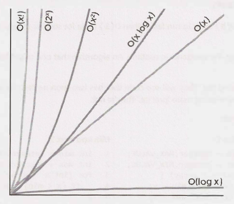
- (2)
    - `O(x^x)`
    - `O(2^x x x!)`

</details>

---

## Multi-Part Algorithms: Add vs. Multiply

---

- (*) Big O - Multi-Part Algorithms: Add vs. Multiply.
- (1) Suppose you have an algorithm that has two steps. When do you multiply the runtimes (time complexities) and when do you add them?

<details>

- (1)
    - Add:
        - If we do A chunks of work then B chunks of work.
    - Multiply:
        - If we do B chunks of work for each element in A.

</details>

---

## Amortized Time

---

- (*) Big O - Amortized Time.
- (1) What is an `ArrayList`?
- (2) What is the internal implementation of an `ArrayList`?
- (3) How do you describe the runtime (time complexity) of insertion?
- (4) How are these two runtimes (time complexities) dealt with?

<details>

- (1) A class that contains a dynamically resizing array.
- (2)
    - An `Arraylist` is implemented with an array.
    - When the array hits capacity, the `Arraylist` class will create a new array with double the capacity and copy all the elements over to the new array.
- (3)
    - Ordinarily: `O(1)`. When a new value is inserted into an empty element of the array and there is nothing else to do.
    - Exceptionally: `O(N)`. When the array is full and so a new array of size `2N` needs to be created and then `N` elements need to be copied over.
- (4)
    - By having a concept that takes both into account.
    - Amortized time.
    - The exceptional case has a runtime (time complexity) that scales much faster than the ordinary case.
    - However, as the exceptional case is relatively rare compared to the frequency of the ordinary case...
    - ... _the exceptional cost is amortized_.

</details>

---

- (*) Big O - Amortized Time.
- (1) Regarding an array, what is:
    - (a) an element?
    - (b) the capacity?
    - (c) the size?
- (2)
    - What is the time complexity of inserting `X` elements into an array?
    - You can assume that `X` is a power of 2.
    - The array capacity is doubled when the size is a power of 2.
- (3) What is the amortized time for each insertion into an `ArrayList`?

<details>

- (1)
    - (a) The things that are put into an array.
    - (b) The number of elements that can be put into an array.
    - (c) The number of elements in an array.
- (2)
    - The arrays are doubled at the following capacities: 1, 2, 4, 8, ..., X.
    - At each doubling the following number of copies need to be made: 1, 2, 4, 8, ..., X.
    - Sum of copies: Almost `2X` (I believe it is `2X - 1`).
    - Time complexity: `O(2X)`
- (3) `O(1)`.

</details>

---

## Log N Runtimes

---

- (*) Big O - Log N Runtimes.
- (1) Name an example of a search type and input in which you will get a `O(log N)` time complexity.
- (2) Starting of with N elements, list the number of elements in the problem space from the previous answer, assuming the algorithm goes right to the end.
- (3) Given that the max number of steps to reduce the problem space to it's smallest size is `k`, form an equation representing this.
- (4) Turn this equation to `O(log N)`.
- (5) What is the takeaway?
- (6) Does the base of the log matter?

<details>

- (1)
    - A binary search in an N-element sorted array.
    - Finding an element in a N-element balanced binary (search) tree.
- (2)
    - Starting of with `N` elements.
    - `N`, `N/2`, `N/4`, ..., `1`.
    - Answer 2, part 2.
- (3)
    - `2^k = N`
- (4)
    - `log<2>(2^k) = log<2>(N)`
    - `k = log<2>(N)`
    - Since:
        - `k` = Number of steps.
    - `O(log<2>(N))`
    - `O(log N)`
- (5)
    - When you see a problem where the number of elements in the problem space gets halved each time, that will likely be a `O(log N)` time complexity (runtime).
- (6)
    - No, for the purposed of Big O.
    - Longer explanation skipped.
    - From next section:
        - The base of a log doesn't matter for big O since logs of different bases are only different by a constant factor.

</details>

---

## Recursive Runtimes

---

- (*) Big O - Recursive Runtimes.
- (1) What is the time complexity of a recursive method that calls itself `B` times and goes `N` layers deep?
    - a) Describe the recursive calls as a tree.
    - b) What does each node represent?
    - c) What is the total number of nodes?
    - d) Simplify this total number for `B = 2`.
    - e) What is the time complexity for `B = 2`?
    - f) Generalise this.
- (2) Does the base of an exponent matter?
- (3) Compare `2^N` and `8^N`.
- (4) What is the typical space complexity of a recursive method?

<details>

- (1)
    - (a) The recursive calls can be represented as a tree where the number of branches of each node is `B` and the number of node layers is `N`.
    - (b) Each node is a method call.
    - (c) The total number of nodes is `B^0 + B^1 + B^2 + B^3 + ... B^N`
    - (d)
        - `2^0 + 2^1 + 2^2 + 2^3 + ... 2^N`
        - `2^(N+1) - 1`
    - (e) `O(2^(N+1) - 1)` => `O(2^N)`
    - (f) Time complexity: `O(B^N)`
- (2)
    - Yes.
    - This is unlike logs.
- (3)
    - `8^N` = `2^3N` = `2^2N * 2^N`
    - `8^N` and `2^N` are different by a factor of `2^2N`.
    - This is not a constant factor!
- (4) `O(N)` as multiple recursive calls from within a function do not exist at the same time, so only the depth matters here.

</details>

---

## Examples and Exercises

---

### Example 1

---

#### Question

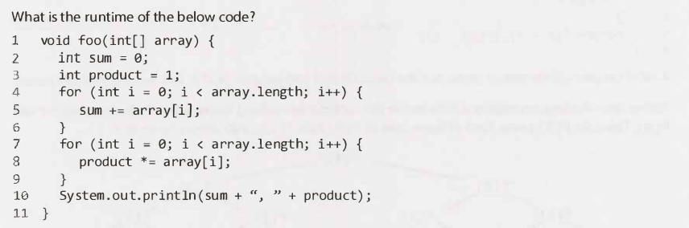

#### Solution

<details>


</details>

---

### Example 2

---

#### Question

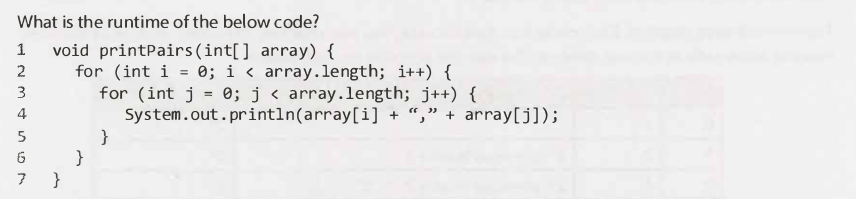

#### Solution

<details>

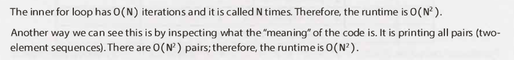

</details>

---

### Example 3

---

#### Question

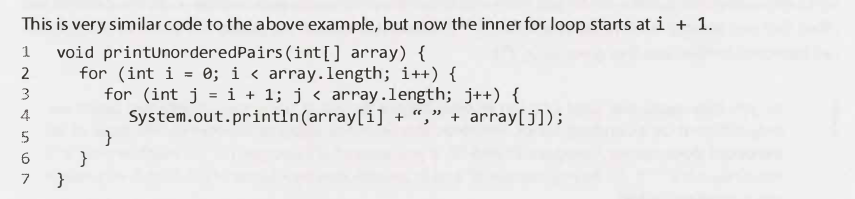

#### Solution

<details>

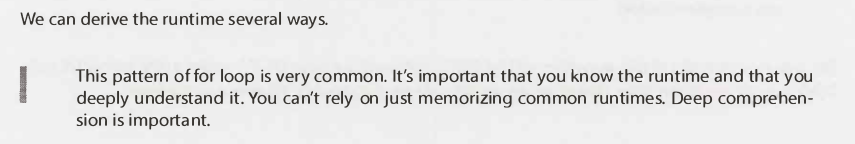
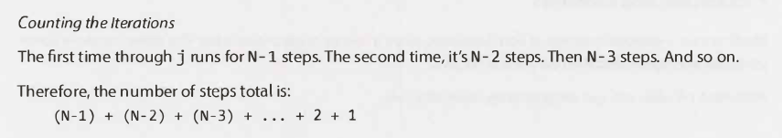
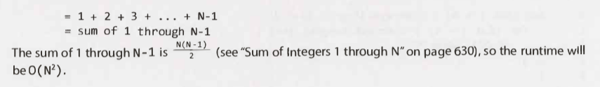
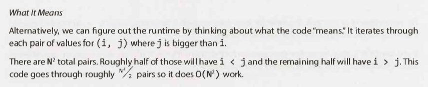
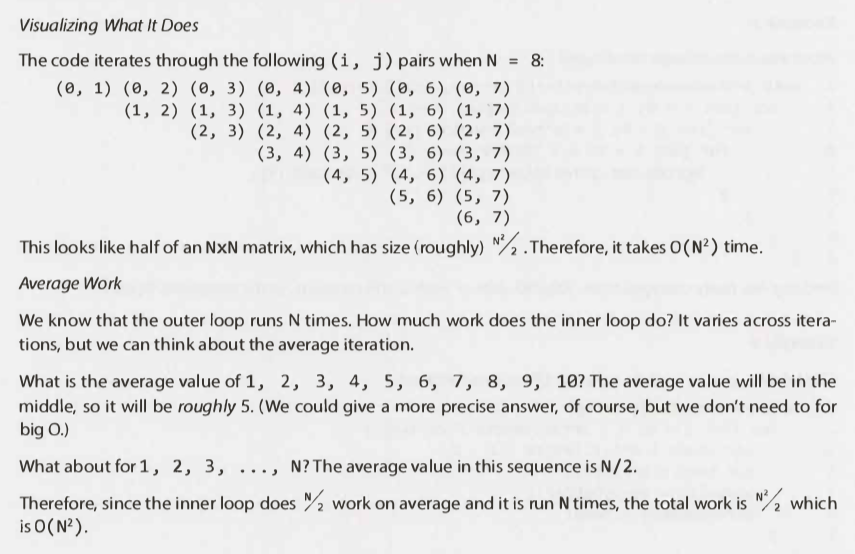

</details>

---

### Example 4

---

#### Question

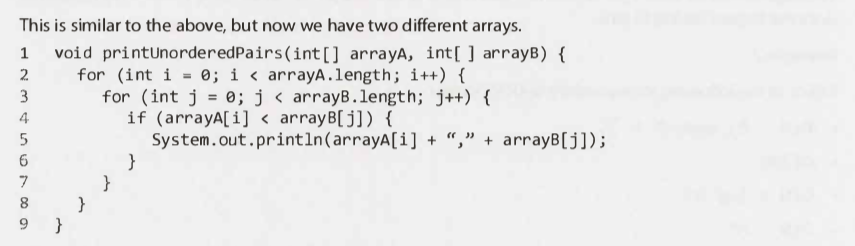

#### Solution

<details>

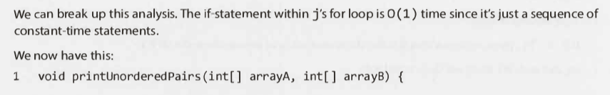
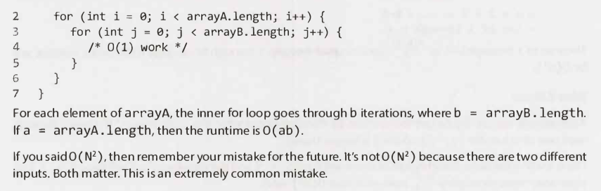

</details>

#### Notes

<details>

- You can replace inner part of code with their time complexities.
- This helps break the problem down.

</details>

---

### Example 5

---

#### Question

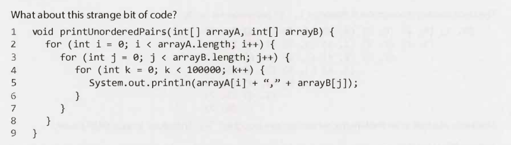

#### Solution

<details>


</details>

---

### Example 6

---

#### Question

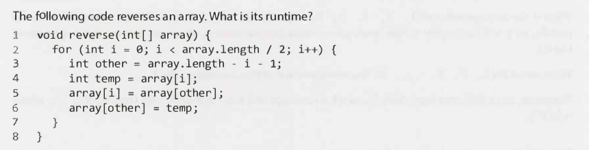

#### Solution

<details>

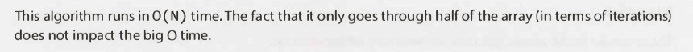

</details>

---

### Example 7

---

#### Question

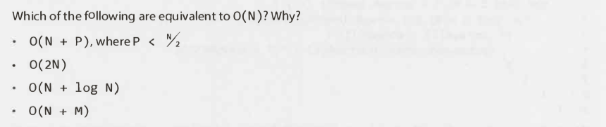

#### Solution

<details>

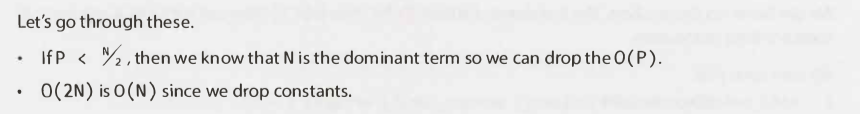
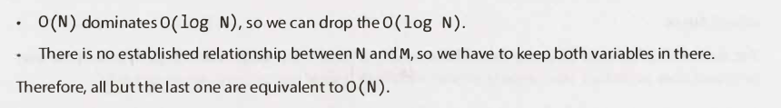

</details>

---