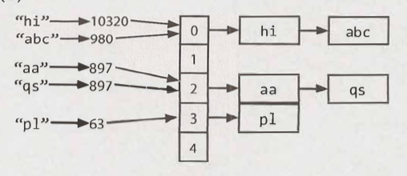

# Arrays and Strings - Main

---

## Hash Tables

---

- (*) Arrays and strings.
- (1) What is a hash table?

<details>

- (1) A hash table is a data structure that maps keys to values for highly efficient lookup.

<!---->

- From Wiki:
    - In computing, a hash table (hash map) is a data structure that implements an associative array abstract data type, a structure that can map keys to values.

</details>

---

- (*) Arrays and strings.
- (1) Detail two hash table implementations.

<details>

- (1)
    - [1] An array of linked lists and a hash code function.
    - [2] A balanced binary search tree.
        - TODO: Not sure how this is a hash table implementation.

</details>

---

- (*) Arrays and strings.
- (1) [1] An array of linked lists and a hash code function: Diagram?

<details>

- (1)
    - 

</details>

---

- (*) Arrays and strings.
- (1) [1] An array of linked lists and a hash code function: Time complexity?

<details>

- (1) `O(1)` - `O(N)`.

</details>

---

- (*) Arrays and strings - Hash tables.
- (1) [2] A balanced binary search tree: 3 details?

<details>

- (1) Another implementation: A balanced binary search tree.
    - `O(log N)`.
    - Potentially less space.
    - Can iterate through keys in order.

</details>

---

## ArrayList & Resizable Arrays

---

- (*) Arrays and strings.
- (1) Java arrays: Length: Resizeable or fixed?

<details>

- (1) Fixed.

</details>

---

- (*) Arrays and strings.
- (1) Java array alternative & 3 points?

<details>

- (1) In Java an `ArrayList` class provides:
    - An array-like data structure...
    - that offers dynamic resizing.
    - Resizing factor: 2.

</details>

---

- (*) Arrays and strings.
- (1) Detail 3 efficiency points on `ArrayList`.

<details>

- (1)
    - Access time: `O(1)`.
    - Each doubling takes `O(n)` time.
    - ... Rare. Amortized insertion time: `O(1)`.

</details>

---

- (*) Arrays and strings - `ArrayList`.
- (1) How many elements were copied to have an array of size n?

<details>

- (1)
    - Final capacity increase: # copied:  n/2.
    - Previous capacity increase: # copied: n/4.
    - ...
    - Second capacity increase: # copied: 2.
    - First capacity increase: # copied: 1.
    - Total copies: n/2 + n/4 + ... + 2 + 1.
        - = `n - 1` (?)

</details>

---

## StringBuilder

---

- (*) Arrays and strings.
- (1) Word for adding strings together?

<details>

- (1) Concatenation.

</details>

---

- (*) Arrays and strings.
- (1) The following function concatenates a list of strings. What is the efficiency of this function? Assume the strings in the list are all of length x. Length of list: n.

```java
String joinWords(String[] words) {
    String sentence = "";

    for (String w : words) {
        sentence = sentence + w;
    }

    return sentence;
}
```

<details>

- (1)
    - On each concatenation: New string is created and the old string and the new string are copied over, character by character.
    - First iteration: Copies: x.
    - Second iteration: Copies: 2x.
    - Last iteration: Copies: nx.
    - Total time: x + 2x + ... + nx
        - = (x(n(n + 1)))/2
        - = (x(n^2 + n))/2
        - = (xn^2 + xn)/2
        - ~ xn^2
        - `O(xn^2)`

</details>

---

- (*) Arrays and strings.
- (1) A class that can help concatenate strings? And 2 details? And use?

<details>

- (1)
    - `StringBuilder`.
    - Creates a resizable array of all the strings.
    - Copies them back to a string when necessary.
    - Example use:

```java
String joinWords(String[] words) {
    StringBuilder sentence = new StringBuilder();

    for (String w : words) {
        sentence.append(w);
    }

    return sentence.toString();
}
```

</details>

---

- (*) Arrays and strings.
- (1) Implement your own version of `StringBuilder`, `HashTable` and `ArrayList`.

<details>

- (1) TODO.

</details>

---