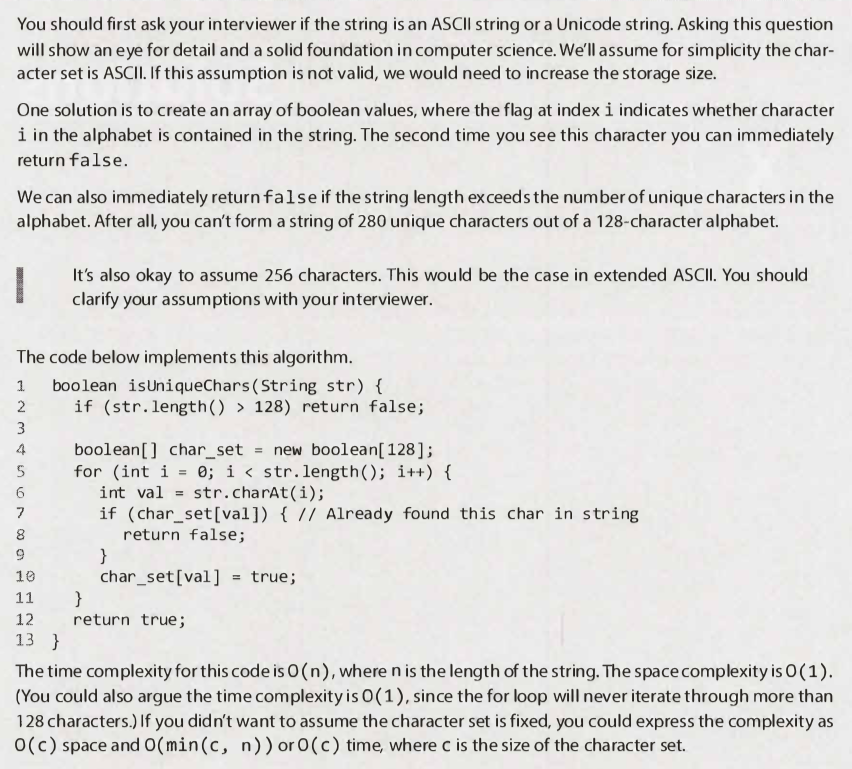
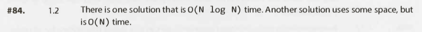

# Arrays and Strings - Questions

---

## Interview Questions

---

### Question 1

#### Question

#### Hints

Hint #44

Hint #117

Hint #132

#### Solution

Key points

- ASCII vs Unicode.
- Boolean flags.
- Initial check based on string length.
- Complexity:
    - Fixed character set:
        - Time: `O(n)` or `O(1)`.
        - Space: `O(1)`.
    - Variable character set:
        - Time: `O(min(c, n))` or `O(c)`.
        - Space: `O(c)`.
    - Where:
        - `n`: Length of the string.
        - `c`: Size of the character set.
- Bit vector.
    - Boolean: Data size in Java: 8 bits (?).
- No additional data structures: (!understand)
    - Compare all.
        - Complexity:
            - Time: `O(n^2)`.
            - Space: `O(1)`.
    - Sort & linear check.
        - Complexity:
            - Time: `O(n log n)`.
            - Space: `O(1)`.

Full solution

Additional notes

- ASCII vs Unicode
    - ASCII (Extended)
        - Regular
            - 2^7 characters. (128).
            - English.
        - Extended
            - 2^8 characters. (256).
            - Languages based on the latin alphabet.
        - Text can be stored as ASCII (Extended). In Bytes.
    - Unicode
        - 2^21 characters.
        - For all world-wide languages.
        - Abstract representation of text.
        - The unicode needs to be encoded to be stored.
            - UTF-8 and UTF-16 are variable length encodings.
            - In UTF-8, a character may occupy a minimum of 8 bits.
            - In UTF-16, a character length starts with 16 bits.
            - UTF-32 is a fixed length encoding of 32 bits.

---

### Question 2

#### Question

#### Hints

Hint #1

Hint #84

Hint #122

Hint #131

#### Solution

Key points

- N/A

Full solution

Additional notes

- N/A

---