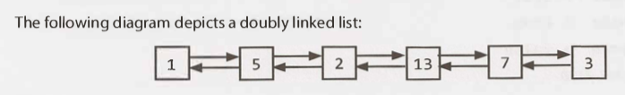
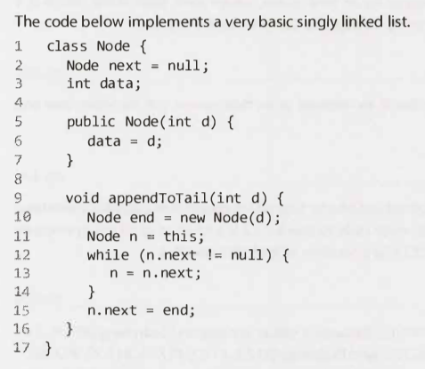
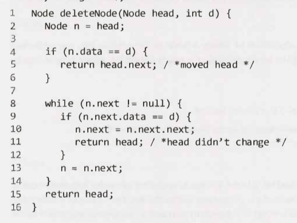
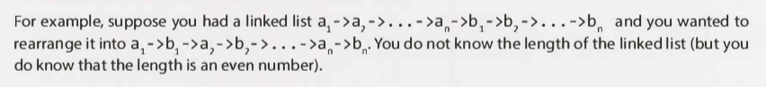

# Linked Lists - Main

---

- (*) Linked lists.
- (1) Definition: Linked list? 2 points.

- (1)
    - Data structure that represents
    - a sequence of nodes.

---

What are two types of linked lists?

- (1) Singly linked list.
    - Each node points to the next node.
- (2) Doubly linked list.
    - Each node to both the next and the previous node.

---

Talk about the time aspects of a linked list: 2 points. And compare with an array.

- Does not provide constant time access to a particular "index" (node) within the list.
     - This is unlike an array.
- Adding/removing items from the beginning of the list can be done in constant time.
     - End too (?), but this is the same as in arrays.
     - For specific applications this can be useful.

---

## Creating a Linked List

---

Implement the code for a very basic singly linked list.

---

Basic singly linked list implementation: How do you access the linked list? What are the implications of this?

- Acccess: Through a reference to the head node.
- If multiple objects need a reference to the linked list and the head of the linked list changes, some objects might still be pointing to the old head.

---

Native implementation of a linked list in Java? And 3 points.

- `LinkedList`.
- Could wrap the basic implementation above.
- Essentially: Single member variable: The head node.
- Largely resolve earlier issue.

---

Interview: Discussing: Linked lists: What should you understand/know?

- You should know whether you are dealing with a singly or doubly linked list.

---

## Deleting a Node from a Singly Linked List

---

What needs to happen in a singly linked list? And a doubly linked list?

- If the node we want to delete is `n`.
- Singly:
    - Find the previous node ,`prev`, where `prev.next = n`.
    - Set `prev.next` to `n.next`.
- Doubly:
    - Above.
    - Set `n.next.prev` to `n.prev`.

---

When implementing a linked list delete method, what are 2 important things? And a bonus thing?

- (1) Check for the null pointer.
- (2) Update the head or tail pointer as necessary.
- (*) If implementing in a language that requires memory management, consider if the removed node should be deallocated.

---

Detail an example deleteNode method.

---

## The "Runner" Technique

---

What is an alternative name for the "runner" technique?

The second pointer technique.

---

Detail the runner technique. 5 points.

- Iterate through the linked list with two pointers simultaneously.
- One ahead of the other.
- "Fast" and "slow" node.
- The fast node may be ahead by a fixed amount.
- The fast node may hop multiple nodes for each one the slow does.

---

How would you do the following:

- Fast pointer, `p1`, move every 2 nodes for every one move of the slow pointer, `p2`.
- When `p1` reaches the end of the linked list, `p2` will be at the midpoint.
- Move `p1` back to the front and begin weaving the nodes. On each iteration `p2` selects a node and inserts it after `p1`.

---

## Recursive problems

---

If you are having problems solving a linked list problem what approach should you explore?

A recursive approach.

---

A later chapter is devoted to recursion.

---

What is the minimum space efficiency of recursive algorithms? And what is `n`?

- `O(n)`.
- Where n is the depth of the recursive call.

---

What is an alternative to a recursive algorithm? Also, 1 note.

- Iteratively.
- These may be much more complex.

---