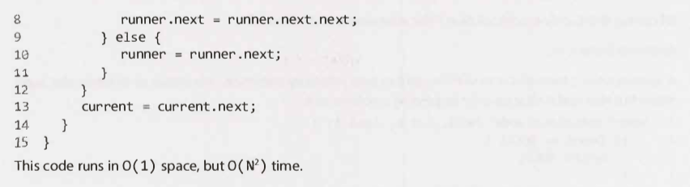
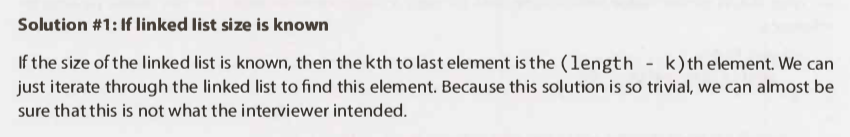

# Linked Lists - Questions

---

## Interview Questions

---

### Question 1

#### Question

#### Hints

Hint #9

Hint #40

#### Solution

Key points

- Hash table: Complexity: Time: `O(n)`.
- Iterate: Complexity: Time: `O(n^2)`.
- Where: `n`: Number of elements in the linked list.

Full solution

Additional notes

- N/A.

---

### Question 2

#### Question

#### Hints

Hint #8

Hint #25

Hint #41

Hint #67

Hint #126

#### Solution

Key points

- N/A

Full solution

Additional notes

- N/A

---