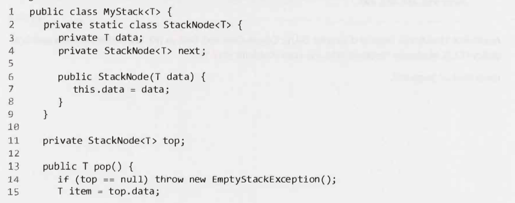
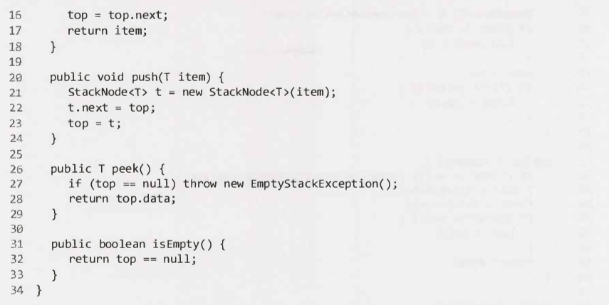
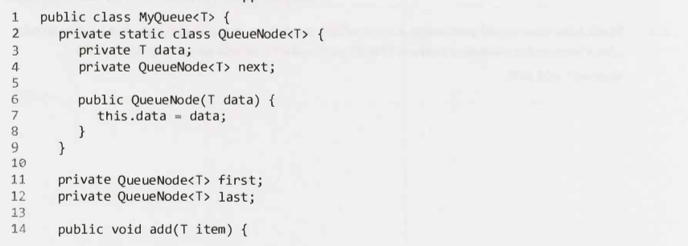
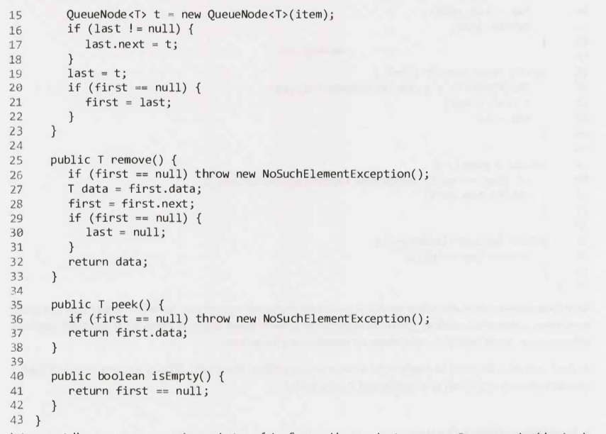

# Stacks and Queues - Main

---

## Implementing a Stack

---

- (*) Stacks and queues.
- (1) What is a stack and what is it an alternative to?

- (1)
    - A stack is a data structure.
    - It is an alternative to an array.

---

- (*) Stacks and queues.
- (1) What ordering does a stack use?

- (1) A stack uses LIFO (last-in first-out) ordering.

---

Detail four stack operations.

- pop(): Remove the top item from the stack.
- push(item): Add an item to the top of the stack.
- peek(): Return the top of the stack.
- isEmpty(): Return true if and only if the stack is empty.

---

Compare add, access & removes of elements in a stack to an array.

- Access: Does not offer constant-time access to the ith item.
- Add / removes: Does allow constant-time access.

---

Code a simple stack.

---

In what type of algorithms might a stack be useful. x2.

- Recursive algorithms.
- Recursive algorithms implemented iteratively.

---

## Implementing a Queue

---

What ordering does a queue use?

- A queue uses FIFO (first-in first-out) ordering.

---

Detail four queue operations.

- add(item): Add an item to the end of the list.
- remove(): Remove the first item in the list.
- peek() : Return the top of the queue.
- isEmpty(): Return true if and only if the queue is empty.

---

Code a simple queue.

---

What are the tricky parts of implementing a queue and should be double checked?

- The updating of the first and last nodes in a queue.

---

Name two places where queue are often used.

- Breadth-first search.
    - Use a queue to store a list of the nodes that we need to process.
    - Each time we process a node, we add it's adjacent nodes to the back of the queue.
    - This allows us to process nodes in the order in which they are viewed.
- Implementing a cache.

---