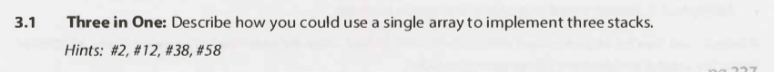
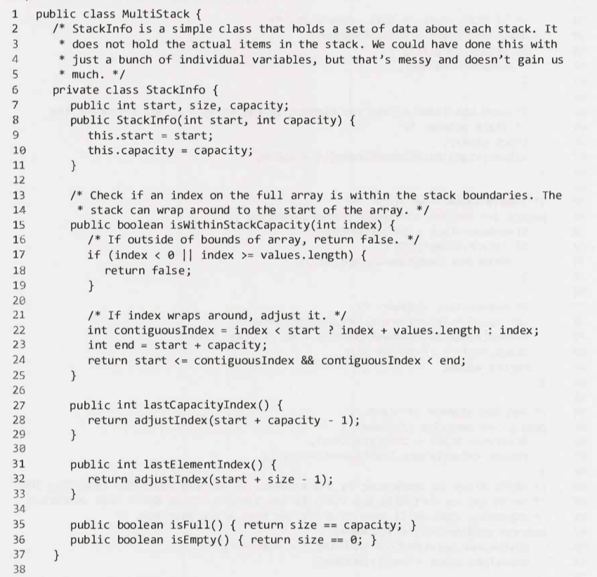

# Stacks and Queues - Questions

## Interview Questions

---

### Question 1

#### Question

#### Hints

Hint #2

Hint #12

Hint #38

Hint #58

#### Solution

Key points

- N/A

Full solution

Additional notes

- N/A

---

### Question 2

#### Question

#### Hints

Hint #27

Hint #59

Hint #78

#### Solution

Key points

- N/A

Full solution

Additional notes

- N/A

---