# Trees and Graphs - Main

---

- __(*) Trees and graphs.__
- __(1) What type of data structure is a tree?__

- (1)
    - A non-linearly organised data structure.
    - This is unlike an array or a linked list.

---

- __(*) Trees and graphs.__
- __(1) In any algorithm regarding a tree, what two things must be evaluated?__

- The worst case time.
- The average case time.

<!---->

- These times may vary wildly.

---

- __(*) Trees and graphs.__
- __(1) What is a tree a type of?__

- (1) A graph.

---

__What must you clarify with the interviewer?__

- The definitions of terms.
- These can vary between sources.

---

## Types of Trees

---

__Detail what a tree is. (4 points. 1 point. 4 points.)__

- (1) A tree is a data structure composed of __nodes__.
- (2) Each tree has a __root node__.
- (3) The root node has __zero or more child nodes__.
- (4) Each child node has __zero or more child nodes__.

+ A tree cannot contain cycles.

- Nodes:  
    - May or may not be in a particular order.
    - Could have any data type as values.
    - May or may not have links back to their parent nodes.
    - If it has no children, it is called a "leaf" node.

---

__Code a simple class definition for a Node.__

- 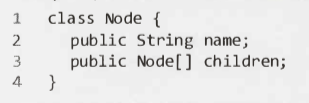
- 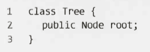
    - The Tree class is optional.

---

### Trees vs. Binary Trees

---

__What is a binary tree?__

- A tree in which each node has up to two children.

---

### Binary Tree vs. Binary Search Tree

---

__What is a binary search tree?__

- A binary tree where each node satisfies the following condition:
    - Given that the value of the node is `n`,
    - all left descendents `< n <` all right descendents
- This is for a tree that cannot have duplicate node values.
- For trees that can have duplicate node values,
  the condition is one of the following:
    - all left descendents `<= n <` all right descendents
    - all left descendents `< n <=` all right descendents
- This should be clarified with the interviewer.
- Note that the conditions state ALL decendents,
  not just the immediate children.
- 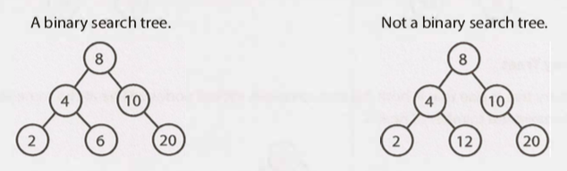

---

### Balanced vs. Unbalanced

---

__What is a balanced tree?__

- A tree that is "not terribly imbalanced".
- Balanced enough for time complexity: `O(log n)`
  for `insert` and `find`.
- But could be more balanced, all the way to being a "perfect binary tree".

---

__Name two common types of balanced trees.__

- Red-black trees.
- AVL trees.

---

__Name 3 types of binary trees and detail them.__

- Complete binary tree:  
    - Where every level of the tree is fully filled.
    - It is ok for the lowest level to not be filled, 
        however it must be filled left to right.
    - 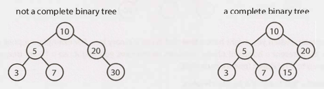

+ Full binary tree:
    - Where every node has either 0 or 2 children.
    - 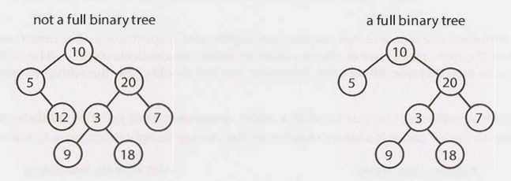

- Perfect binary tree:
    - A binary tree that is both complete and full.
    - Characteristics:
        - All leaf nodes are at the same level.
        - This level has the maximum number of nodes.
    - Rare in real life and in interviews.
    - 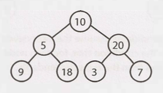

---

## Binary Tree Traversal

---

__Name and detail the three types of binary tree traversals.__

- In-Order Traversal  
    - 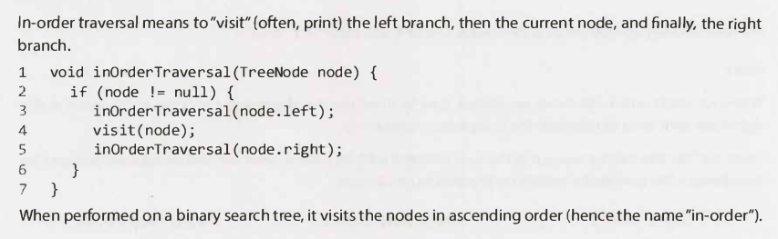

+ Pre-Order Traversal
    - 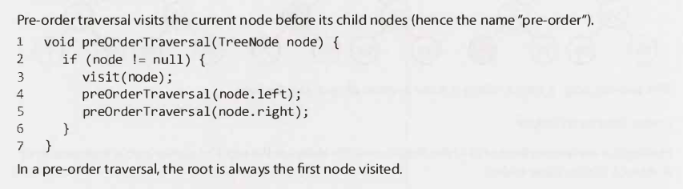

- Post-Order Traversal
    - 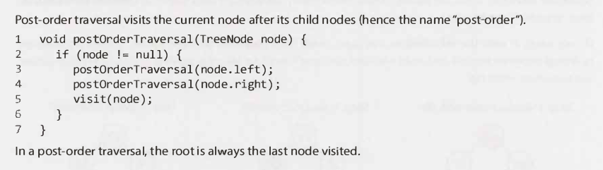

---

## Binary Heaps (Min-Heaps and Max-Heaps)

---

__What is a binary min-heap and a binary max-heap?__

- Min-heap:
    - Complete binary tree.
    - Where each node is smaller than it's children.
- Max-heap:
    - ' ' '
    - ' ' ' larger than it's children.

+ There is no inherent ordering between a left and right child.

---

__What is special about the root node of a binary min/max-heap?__

- Root node:
    - Min-heap: Min element in the tree.
    - Max-heap: Max element in the tree.

---

__What are two key operations on a min-heap?__

- `insert`
- `extract_min`

---

__Detail the `insert` operation on a binary min-heap.__

- Insert the new element in the bottom row,
  in the leftmost spot (to maintain the _complete_ property of the tree).
- "Fix" the tree: Swap the element with it's parent until the appropriate spot is found.
  Essentially bubble up the minimum element.
- Time complexity: `O(log n)`, where `n` is the number of nodes in the heap.
- 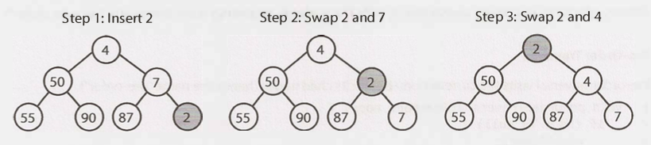

---

__Detail the `extract_min` operation on a binary min-heap.__

- Remove the minimum element and put the last (bottom-most & right-most) element it it's place.
- Bubble down this element until the min-heap property is restored.
- It does not matter if you swap with the left or right child...
- However, you need to swap it with the smaller child in order to maintain min-heap ordering.
- Time complexity: `O(log n)`, where `n` is the number of nodes in the heap.
- 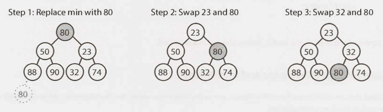

---

## Tries (Prefix Trees)

---

__What is a trie?__

- Sometimes called a prefix tree.
- Varient of an `n`-ry tree.
- A character is stored at each node.
- Each path down the tree may represent a word.
- `*` nodes / "null nodes" are often used to indicate complete words. They could be:
    - (1) A special type of child.
    - (2) Encapsulated as a boolean within the "parent" node.
- `n`:
    - (1): 1 - (`ALPHABET_SIZE` + 1)
    - (2): 0 - `ALPHABET_SIZE`
- 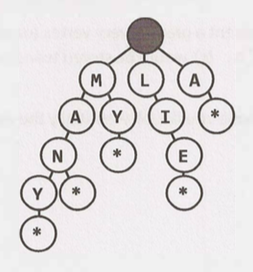

---

__What is a common use case for a trie?__

- A store of the English language for quick _prefix_ lookups.

---

__Why is a hash table not suitable for a prefix lookup?__

- A hash table:
    - can quickly look up whether a string is a valid word.
    - cannot tell if a string is a prefix of any valid words.

---

__How quickly can a trie check if a string is a valid prefix?__

- In `O(K)` time where `K` is the length of the string.
- 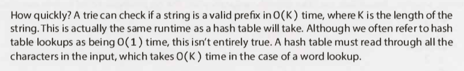

---

__In situations when you search through the tree on related prefixes repeatedly (e.g., looking up M, then MA, then MAN, then MANY) what would be a good way to do it?__

- Keep a reference to the current node in the tree and work from there each time.

---

## Graphs

---

- __(1) What is a graph?__
- __(2) Name two types of graphs (/nodes).__
- __(3) Give two things graphs can have.__
- __(4) Name two types of graphs.__

+ (1) A collection of nodes (/vertices) with edges between (some of) them.

- (2) Graphs (and edges) can be:  
    - Directed
    - Undirected

+ (3):
    - Graphs may consist of isolated subgraphs.
    - Graphs can have cycles.

- (4):
    - Connected graph: Where there is a (direct or indirect) path between every pair of vertices.
    - Acyclic graph: One without cycles.

+ Wiki:
  - 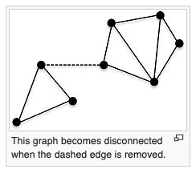

---

__How do a trees relate to graphs?__

- A tree is a connected graph without cycles.

---

Graph example:

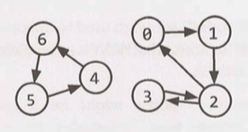

---

__In terms of programming, what are the two common ways to represent a graph?__

- Adjacency List
- Adjacency Matrices

---

### Adjacency List

---

__Detail an adjacency list. 3 points.__

- Every vertex stores a list of adjacent vertices.
- In an undirected graph, an edge like (a, b) will be stored twice.
- It is the most common way to represent a graph.

---

+ __(a) Detail a simple class definition for a graph and a node.__
+ __(b) Why do you need a graph class?__

- (a):
    - 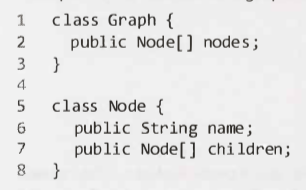
- (b):
    - You need the graph class because, unlike a tree,
      you can't necessarily reach all the nodes from a single node.

---

+ __(a) How can you represent a graph, as an adjacency list, without using any additional classes?__
+ __(b) Comment.__

- (a): Using an array of lists (or a hash table).
    - "Lists": arrays, arraylists, linked lists, etc.
    - e.g.:
        - 
        - ... can be represented as:
        - 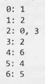
- (b):
    - More compact.
    - Not as clean.
    - Tend to use classes.

---

### Adjacency Matrices

---

- __(a) What is an adjacency matrix?__
- __(b) Detail two implementations.__
- __(c) Details two properties.__

<!---->

- (a):
    - An `N` x `N` matrix that encodes the edges between nodes.
    - `N`: The number of nodes.
- (b):
    - An `N` x `N` boolean matrix.
        - A `true` value at `matrix[i][j]` indicates an edge from node `i` to node `j`.
        - Opposite: `false`.
    - An `N` x `N` integer matrix.
        - A `1` value at `matrix[i][j]` indicates an edge from node `i` to node `j`.
        - Opposite: `0`.
- (c):
    - Undirected graph: Symmetric matrix.
    - Directed graph: Not necessarily symmetric matrix.
-  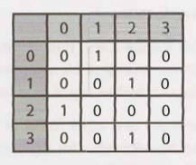

---

__How does an adjacency matrix compare to an adjacency list?__

- Less efficient.
- Adjacency list: Can easily iterate through the neighbours of a node.
- Adjacency matrix: Will need to iterate through all the nodes to identify a node's neighbours.

---

## Graph Search

---

__What are the 2 most common ways to search a graph?__

- Depth-first search (DFS)
- Breadth-first search (BFS)

---

__Describe how a depth-first search (DFS) works.__

- Start: Root or any node.
- Explore each branch completely before moving on to the next branch.
- Can explore nodes in order of their number.
- This search goes deep first before wide.

---

__Describe how a breadth-first search (BFS) works.__

- Start: Root or any node.
- Explore each neighbour before going on to any of their children.
- Can explore nodes in order of their number.
- This search goes wide first before deep.

---

__For the following graph, list the order nodes are visited for both DFS and BFS.__

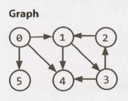

- 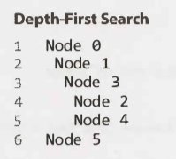
- 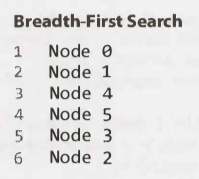

---

__When are DFS and BFS preferred?__

- DFS is often preferred if we want to visit every node in a graph.
- BFS is often preferred if we want to find the shortest path.

---

### Depth-First Search (DFS)

---

__What type of tree traversal is a form of DFS?__

- Pre-order (and other forms).

---

__When implementing a DFS for a graph, what is one important thing you need to check?__

- Check if a node has already been visited.
- If this is not done, you risk getting stuck in an infinite loop.

---

__Detail the pseudocode for an implementation of a DFS.__

- 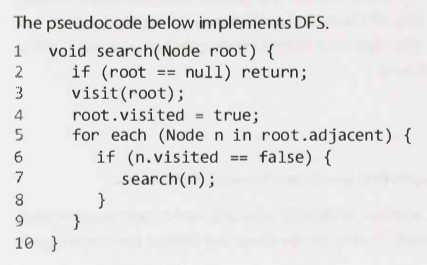

---

### Breadth-First Search (BFS)

---

- __(1) What is the main tripping point of implementing a BFS?__
- __(2) What is the key point in implementing a BFS?__
- __(3) What is the overall design of a BFS implementation?__

- (1): The false assumption that BFS is recursive.
- (2): To use a queue.
- (3): An iterative solution involving a queue.

---

__Detail the pseudocode for an implementation of a BFS.__

- 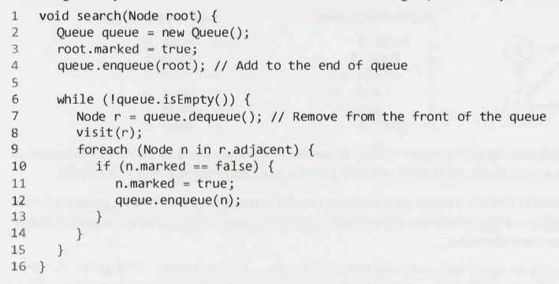

---

### Bidirectional Search

---

- (*) Bidirectional search.
- (1) What is bidirectional search used for?
- (2) How does it work?
- (3) How does it end?

- (1): Finding the shortest path between two nodes (source & destination).
- (2): Running two simultaneous breadth-first searches.
- (3): When their searches collide, a path has been found.

---

- (*) Bidirectional search.
- (1) Draw out the searched nodes when finding a path from node `s` to node `t` using a
    - (a) Breadth-first search.
    - (b) Bidirectional (breadth-first) search.
- The number of nodes b/w `s` and `t` is `d`.
- (2) Find the time complexity of (a) and (b).
- (3) By what factor is (b) faster than (a)?

- (1): (a) & (b):
    - 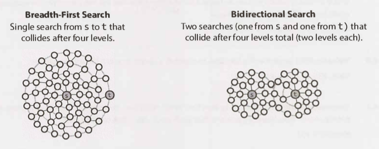
- (2):
    - 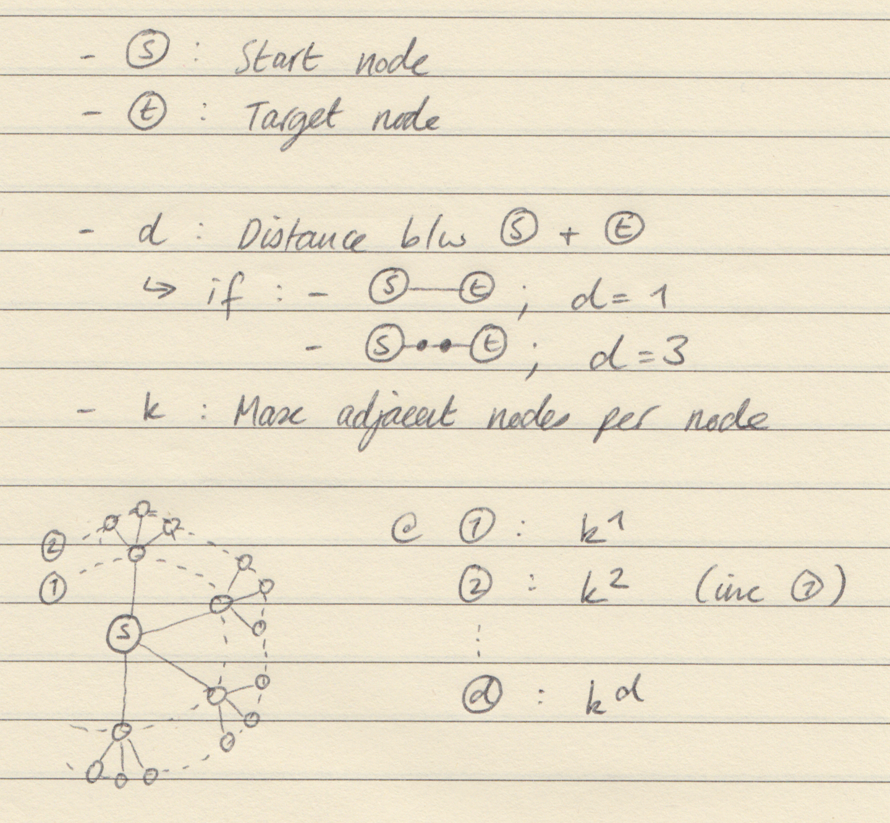
    - (a): `O(k^d)`
    - (b): `O(k^(d/2))`
- (3): k^(d/2)

---

- Additional reading:
    - Topological Sort (pg 632).
    - Dijkstra's Algorithm (pg 633).
    - AVL Trees (pg 637).
    - Red­ Black Trees (pg 639).

---