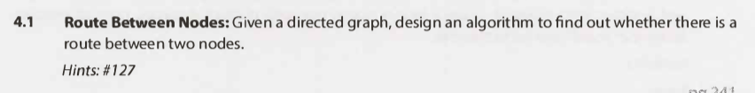
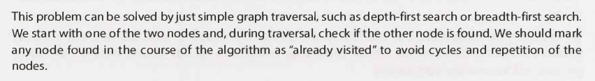
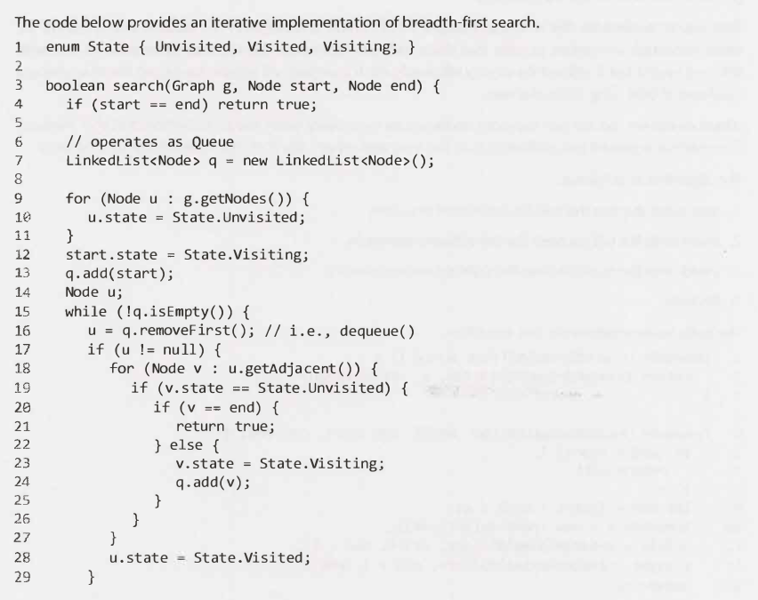
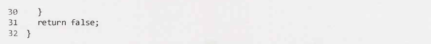
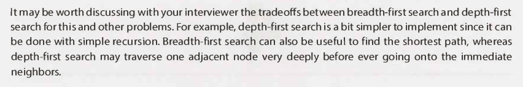
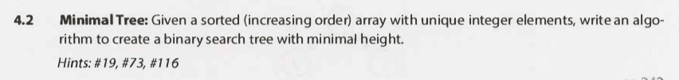
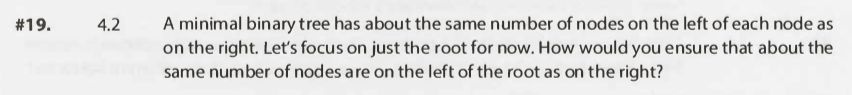
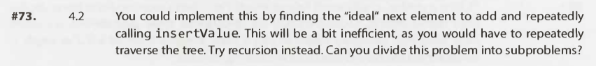
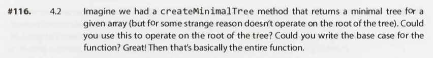

# Trees and Graphs - Questions

## Interview Questions

---

### Question 1

#### Question

#### Hints

Hint #127

#### Solution

Key points

- Can be solved by a simple graph traversal algorithm, e.g.:
    - Depth-first search.
    - Breadth-first search.
- During traversal, check if nodes have already been found.
    - Can mark as "already found".
    - To avoid cycles and repetition.

<!---->

- Depth-first search:
    - Simpler to implement.
    - As it can be done with recursion.
- Breadth-first search:
    - Does not go deep (unnecessarily).

Full solution

Additional notes

- N/A

---

### Question 2

#### Question

#### Hints

Hint #19

Hint #73

Hint #116

#### Solution

Key points

- N/A

Full solution

Additional notes

- N/A

---