# Bit Manipulation - Main

---

## Bit Manipulation By Hand

---

- __(*) Bit manipulation.__
- __Detail 6 bitwise operators (excluding + & -).__

- 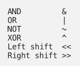

---

- [Medium\_-\_Nicol\_Leung\_-\_Bitwise\_operations\_cheat\_sheet](./Medium_-_Nicol_Leung_-_Bitwise_operations_cheat_sheet.pdf)

---

- __(*) Bit manipulation.__
- __(1) Carry out the following bit calculations by hand.__
    - 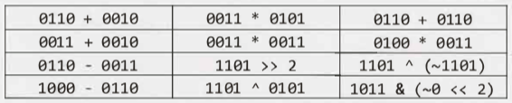
    - __The calculations in col 3 have tricks to them.__

- (1)
    - Line 1: 1000, 1111, 1100
    - Line 2: 0101, 1001, 1100
    - Line 3: 0011, 0011, 1111
    - Line 4: 0010, 1000, 1000
    - 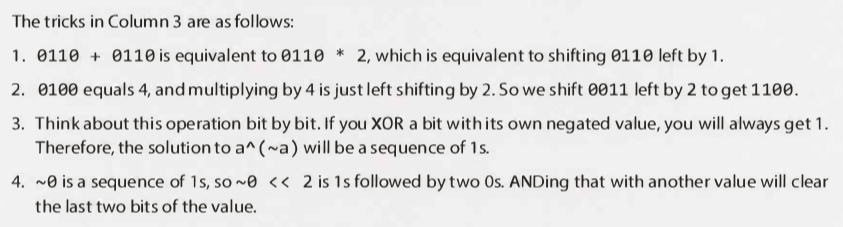

---

## Bit Facts and Tricks

---

- __(*) Bit manipulation.__
- __(1) Calculate the following expressions.__
    - `x ^ 0s`
    - `x ^ 1s`
    - `x ^ x`
    - `x & 0s`
    - `x & 1s`
    - `x & x`
    - `x | 0s`
    - `x | 1s`
    - `x | x`
- __Note that `1s` and `0s` represent a sequence of 1s and 0s respectively.__

- (1)
    - `x ^ 0s = x`
    - `x ^ 1s = ~x`
    - `x ^ x = 0`
    - `x & 0s = 0`
    - `x & 1s = x`
    - `x & x = x`
    - `x | 0s = x`
    - `x | 1s = 1s`
    - `x | x = x`

---

## Two's Complement and Negative Numbers

---

- [Wiki - Two's complement](https://en.wikipedia.org/wiki/Two%27s_complement)

---

- __(*) Two's complement.__
- __(1) What is two's complement?__
- __(2) How do you calculate the two's complement?__
- __(3) What is another way of saying the two's complement of an N-bit number?__
- __(4) What is the relationship between a number encoded in a N-bit number, it's two's complement and `2^N`?__

- (1) Two's complement is a mathematical operation on binary numbers.
- (2) The two's complement is calculated by inverting the bits of a number and adding one.
- (3) The complement of the number with respect to `2^N`.
- (4) An N-bit number + it's two's complement with respect to `2^N` = `2^N`.

---

- __(*) Two's complement.__
- __(1) What is a common use for two's complement? Detail.__
- __(2) Why is this a common use?__

- (1) Two's complement is commonly used in computing as a method of signed number representation.
    - Here the signed number consists of 1 sign bit and a number of value bits.
    - A positive number contains a 0 in the sign bit and the (binary representation of the) number in the value bits.
    - A negative number contains a 1 in the sign bit and the two's complement of the absolute of the number in the value bits.
    - If the number of bits used for the number's value is `N`, the two's complement is calculated with respect to `2^N`. The sign bit is not considered when calculating the two's complement.
- (2)  Two's complement has the advantage that the fundamental arithmetic operations of addition, subtraction, and multiplication are identical to those for unsigned binary numbers (as long as the inputs are represented in the same number of bits - as the output, and any overflow beyond those bits is discarded from the result).

---

- __(*) Two's complement.__
- __(1) Give a formula to calculate the binary representation of -K (negative K).__
    - __Where `N` is the number of bits representing the number, including the sign.__

- (1) `concat(1, 2^(N-1) - K)`

---

- __(*) Two's complement.__
- __(1) Calculate the two's complement of the following numbers:__
    - 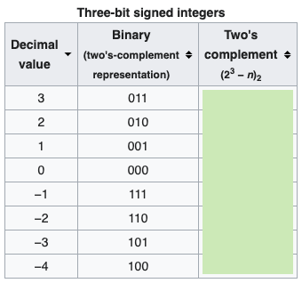

- (1) 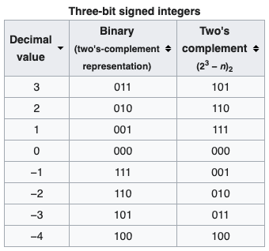
- Note that 4 and -4 have the same binary values.

---

## Arithmetic vs. Logical Right Shift

---

- __(*) Right shift.__
- __(1) Detail the logical right shift.__
- __(2) Detail the arithmetic right shift.__
- __(3) Right shift the following number using these two methods:__
    - 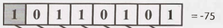

- (1) Logical right shift:
    - Shifts all the bits to the right, including the sign bit.
    - A `0` is put into the sign bit / the most significant bit.
    - Operator: `>>>`.
    - 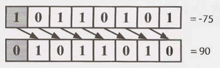
- (2) Arithmetic right shift:
    - Shifts all the bits to the right, including the sign bit.
    - Puts the same bit in the sign bit as was there before.
    - This has the effect of (roughly) dividing by two (for both positive and negative numbers).
    - Operator: `>>`.
    - 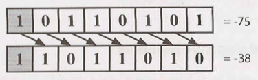
- (3) See above.

---

- __(*) Right shift.__
- __(1) If you repeatedly did a logical right shift on a (-/+) number, what would be the result?__
- __(2) If you repeatedly did an arithmetic right shift on a (-/+) number, what would be the result?__

- (1) 0. As as we are shifting a zero into the most significant bit repeatedly.
- (2) -1. As as we are shifting a one into the most significant bit repeatedly.
    - A sequence of all 1s in a (signed) integer represents -1.

---

### Common Bit Tasks: Getting and Setting

---

- __(*) Bit manipulation.__
- __Get bit:__
    - __(1) Describe how you would get the value of the `i`th bit from a number, `num`.__
        - __Where the indices of the number's bits start at 0.__
    - __(2) Write a function that does this.__

- (1):
    - Shift the number 1 to the left i times.
    - AND this with `num`.
    - Compare this with `0`.
- (2):
    - 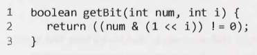

---

- __(*) Bit manipulation.__
- __Set bit:__
    - __(1) Describe how you would set the value of the `i`th bit in a number to 1, `num`.__
        - __Where the indices of the number's bits start at 0.__
    - __(2) Write a function that does this.__

- (1):
    - Shift the number 1 to the left i times.
    - OR this with `num`.
- (2):
    - 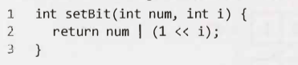

---

- __(*) Bit manipulation.__
- __Clear bit:__
    - __(1) Describe how you would clear the value of the `i`th bit in a number, `num`.__
        - __Where the indices of the number's bits start at 0.__
    - __(2) Write a function that does this.__

- (1):
    - Shift the number 1 to the left i times.
    - Negate this number (this will be the mask).
    - AND this with `num`.
- (2):
    - 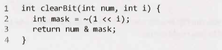

---

- __(*) Bit manipulation.__
- __Clear bits MSB through i:__
    - __(1) Describe how you would clear the value of the `i`th bit in a number, `num`, and all of the more significant bits.__
        - __Where the indices of the number's bits start at 0.__
    - __(2) Write a function that does this.__

- (1):
    - Create a mask with a 1 in the ith bit.
    - Subtract 1 from this mask to give a number with 1s below the ith bit.
    - AND this with `num`.
- (2):
    - 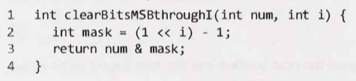

---

- __(*) Bit manipulation.__
- __Clear bits i through 0:__
    - __(1) Describe how you would clear the value of the `i`th bit in a number, `num`, and all of the less significant bits.__
        - __Where the indices of the number's bits start at 0.__
    - __(2) Write a function that does this.__

- (1):
    - Create a mask with a value of -1, i.e. all 1s.
    - Shift the mask left by `i + 1`.
    - AND this with `num`.
- (2):
    - 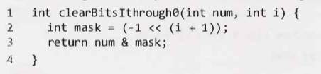

---

- __(*) Bit manipulation.__
- __Update bit:__
    - __(1) Describe how you would update the value of the `i`th bit in a number, `num`.__
        - __Where the indices of the number's bits start at 0.__
    - __(2) Write a function that does this.__

- (1):
    - Use a mask to clear the ith bit.
    - Shift the intended value left by i bits.
    - OR the two together.
- (2):
    - 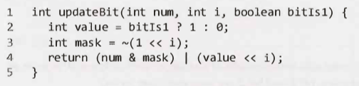

---