# Bit Manipulation - Questions

## Interview Questions

---

### Question 1

#### Question

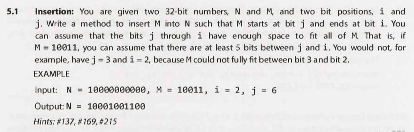

#### Hints

Hint #137

Hint #169

Hint #215

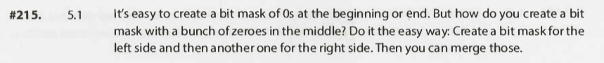

#### Solution

Key points

- There are two ways to get a number of 1s:
    - `-1`
        - This assumes two's complement.
    - `~0`
        - This does not assume anything - Preferred.

Full solution

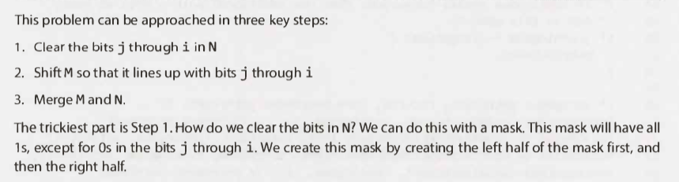

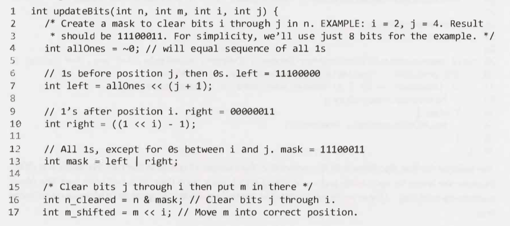

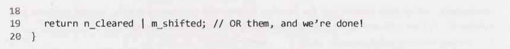

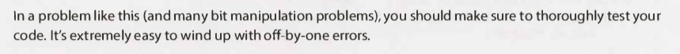

Additional notes

- N/A

---

### Question 2

#### Question

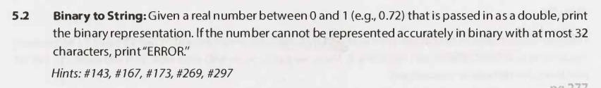

#### Hints

Hint #143

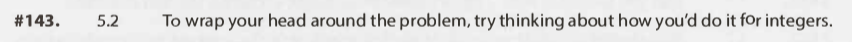

Hint #167

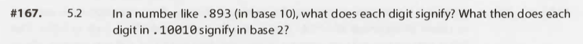

Hint #173

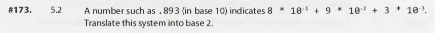

Hint #269

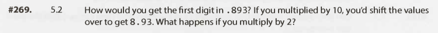

Hint #297

#### Solution

Key points

- N/A

Full solution

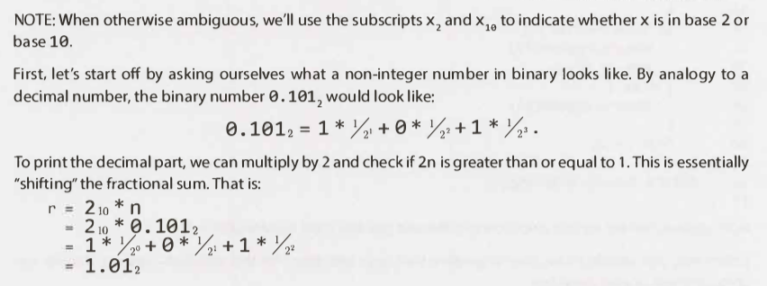

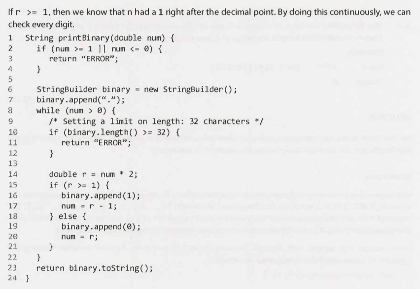

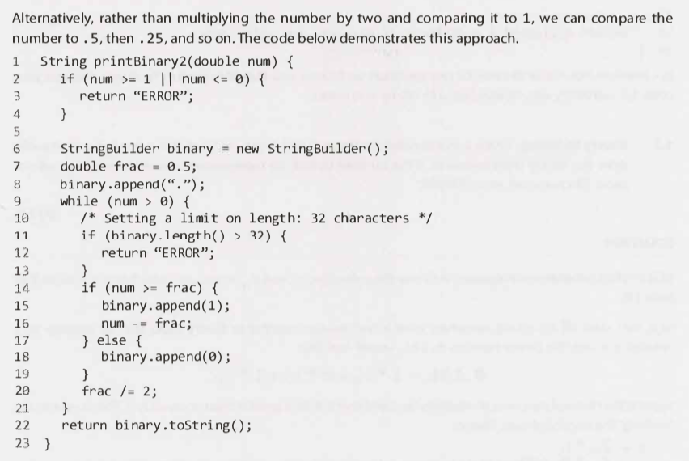

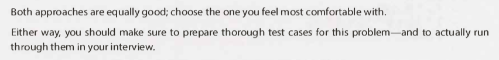

Additional notes

- N/A

---