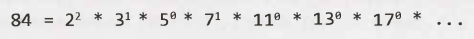
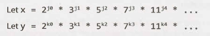
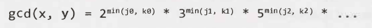
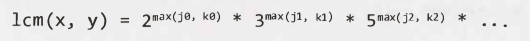
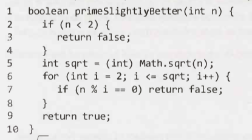
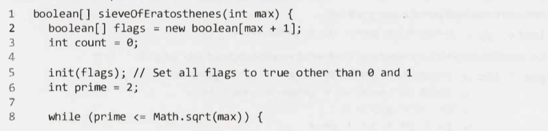
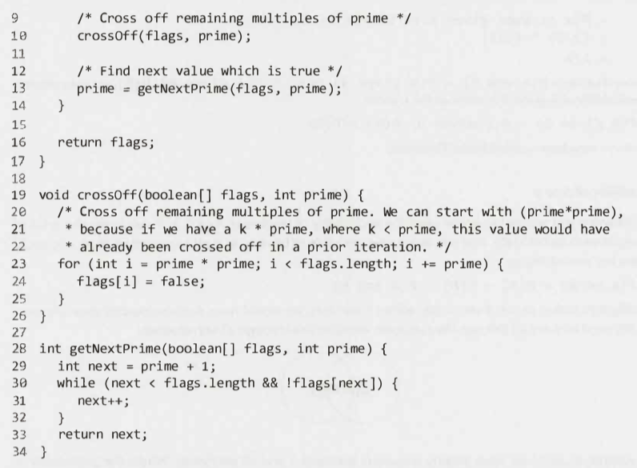
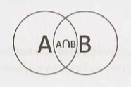

# Math and Logic Puzzles - Main

---

## Prime Numbers

---

- __(*) Prime numbers.__
- __(1) Show how the number 84 can be decomposed into a product of primes.__
- __(2) Name one point to notice about the decomposition.__

- (1)
    - .
- (2) Note that many of these primes have an exponent of zero.

---

### Divisibility

---

- __(*) Prime numbers.__
- __(1) List two ways it can be expressed that `x` is divisible by `y`.__

- (1)
    - `x/y`
        NB: `x/y = y\x`
    - `mod(x, y) = 0`

---

- __(*) Prime numbers.__
- 
- __(1) What is the condition for `x` to be divisible by `y`?__

- (1) If x/y, then for all `i`, `ji >= ki`.
    - If this is not the case there will be a remainder / fractional component in the answer.

---

- __(*) Prime numbers.__
- __(1) What is the greatest common divisor (GCD) of `x` and `y`?__
- __(2) What is the least common multiple (LCM) of `x` and `y`?__
- __(3) What is `GCD(x, y) * LCM(x, y)`?__

- (1)
    - 
- (2)
    - 
- (3) `x * y`

---

### Checking for Primality

---

- __(*) Prime numbers.__
- __(1) What would be one optimisation for checking if the number `n` is a prime number?.__
- __(2) Write the method.__
- __(3) What would be an alternative method?__

- (1) Only check divisibility to up `sqrt(n)`.
    - As for every number that can divide `n` that is between `sqrt(n)` and `n` there is a complement number lower than `n`.
- (2)
    - 
- (3) Check if `n` is divisible by any primes (between `0` and `n`).
    - No need to check every number between `0` and `sqrt(n)`.

---

### Generating a List of Primes: The Sieve of Eratosthenes

---

- __(*) Prime numbers.__
- __(1) What is the Sieve of Eratosthenes?__
- __(2) What is the main principle behind how it works?__

- (1) A highly efficient way to generate a list of primes.
- (2) It works by recognizing that all non-prime numbers are divisible by a prime number.

---

- __(*) Prime numbers.__
- __(1) Describe the method of the Sieve of Eratosthenes.__

- (1)
    - Start with a list of numbers from `2` to the number we want to check, `max`.
    - Cross of all the numbers divisible by `2`.
    - The next lowest number from `2` is the next prime, i.e. `3`.
    - Cross of all the numbers divisible by `3`.
    - The next lowest number from `3` is the next prime, i.e. `5`.
    - Repeat until `max` is reached.
    - You will then have a list of all the primes from `2` to `max`.

---

- __(*) Prime numbers.__
- __(1) Give the method (code) of the Sieve of Eratosthenes.__
- __(2) What is something to note in the method solution?__

- (1)
    - 
    - 
- (2) Note that two helper functions were created in the solution. This is good coding practice.

---

- __(*) Prime numbers.__
- __(1) Give one optimisation that could be made in implementing the Sieve of Eratosthenes.__

- (1) To only use odd numbers in the array / list of numbers to check.
    - This would reduce the space usage by half.

---

## Probability

---

- __(*) Probability.__
- __(1) Draw a Venn diagram of two events, A and B.__

- (1)
    - 

---

### Probability of A and B

---

- __(*) Probability.__
- __Given:__
    - __`P(A)`__
    - __`P(B)`__
    - __`P(B given A)`__
    - __`P(A given B)`__
- __(1) Give two expressions for `P(A and B)`.__

- (1)
    - `P(A and B) = P(B given A) P(A)`
    - `P(A and B) = P(A given B) P(B)`

---

- __(*) Probability.__
- __Given:__
    - __`P(A)`__
    - __`P(B)`__
    - __`P(B given A)`__
    - __`P(A given B)`__
- __(1) Detail a relationship between all these probabilities.__
- __(2) What is the name of this relationship?__

- (1)
    - `P(B given A) P(A) = P(A given B) P(B)` leads to:
        - `P(A given B) = P(B given A) P(A) / P(B)`
        - `P(B given A) = P(A given B) P(B) / P(A)`
- (2) Bayes' Theorem.

---

### Probability of A or B

---

- __(*) Probability.__
- __Given:__
    - __`P(A)`__
    - __`P(B)`__
    - __`P(A and B)`__
- __(1) What is `P(A or B)`?__

- (1) `P(A or B) = P(A) + P(B) - P(A and B)`

---

### Independence

---

- __(*) Probability.__
- __(1) What does independence mean in the context of two events, A and B?__
- __(2) What is `P(A and B)` if they are independent?__

- (1) That the probability of one occurring has no impact on the probability of the other occurring.
- (2)
    - `P(A and B) = P(A) P(B)`

---

### Mutual Exclusivity

---

- __(*) Probability.__
- __(1) What does mutual exclusivity mean in the context of two events, A and B?__
- __(2) What is `P(A or B)` if they are mutually exclusive?__

- (1) That if one event occurs, the other event cannot occur.
- (2)
    - `P(A or B) = P(A) + P(B)`

---

## Start Talking

---

N/A

---

## Develop Rules and Patterns

---

As you go about solving a problem write down "rules" or patterns you discover. This will help you to remember them and also provide a mathematical insight/framework to solve the problem. See example in book if necessary.

---

## Worst Case Shifting

---

- __(*) Math and logic puzzles.__
- __(1) What is a tip for solving puzzles in which you have to find something?__

- (1) Say you need to take some actions in order to find the thing you are looking for. If some of the outcomes of these actions leads to you finding what you are looking for much faster than other outcomes, there is an imbalance. You need to change your actions to balance this out. It should result in a better overall solution. See example in book if necessary.

---

## Algorithm Approaches

---

- __(*) Math and logic puzzles.__
- __(1) What two algorithmic approaches are particularly useful in solving puzzles?__

- (1)
    - Base Case.
    - Build and Do It Yourself.

---