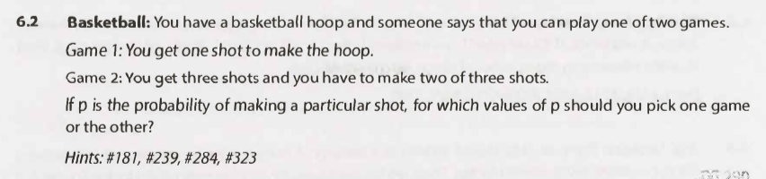

# Chapter name - Questions

---

## Interview Questions

---

### Question 1

#### Question

#### Hints

Hint #186

Hint #252

Hint #319

Hint #387

#### Solution

Key points

- The scale is a regular weighing scale (not a pivot balance).

Full solution

Additional notes

- N/A

---

### Question 2

#### Question

#### Hints

Hint #181

Hint #239

Hint #284

Hint #323

#### Solution

Key points

- N/A

Full solution

Additional notes

- N/A

---