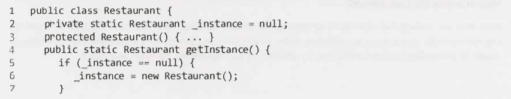
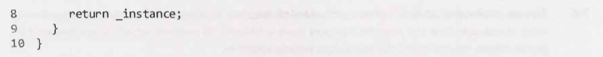
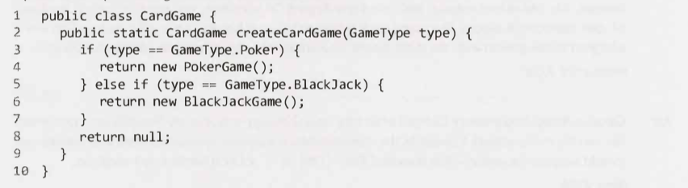

# Object-Oriented Design - Main

---

- N/A

---

## How to Approach

---

- __(*) Object-oriented design.__
- __(1) What are the 4 steps in approaching an object-oriented design question? Detail.__

- (1)
    - Step 1: Handle Ambiguity
        - The question might be vague as a test to see if you will clarify.
        - You need to clarify.
        - Who and how?
        - 6 W's: who, what, where, when, how, why.
    - Step 2: Define the Core Objects
    - Step 3: Analyze Relationships
        - Which objects are members of which other objects?
        - Do any objects inherit from any others?
        - Are relationships many-to-many or one-to-many?
    - Step 4: Investigate Actions
        - You may find that you have forgotten some objects, and you will need to update your design.

<!---->

- Overall:
    - Be careful not to make any assumptions.
        - Talk to your interviewer.

<!---->

- Way to remember:
    - The __big__  __core__ of a __ship__ is what does the  __action__.
        - Am**big**uity.
        - __Core__ objects.
        - __Relationships__.
        - __Actions__.

---

## Design Patterns

---

- Be careful you don't fall into a trap of constantly trying to find the "right" design pattern for a particular problem. You should create the design that works for that problem. In some cases it might be an established pattern, but in many other cases it is not.

---

### Singleton Class

---

- __(*) Object-oriented design.__
- __(1) What does a singleton class/pattern do?__
- __(2) When it is useful?__
- __(3) Why might people not like the singleton pattern?__

- (1) Ensures that a class has only one instance and provides access to that instance.
- (2) When you have a "global" object with exactly one instance.
- (3)
    - One reason is that it can interfere with unit testing.
    - Some people call the Singleton design pattern an "anti-pattern".

---

- __(*) Object-oriented design.__
- __(1) Code a singleton class (for a restaurant).__

- (1)
    - 
    - 

---

### Factory Method

---

- __(*) Object-oriented design.__
- __(1) What does a factory method class/pattern do?__
- __(2) What two things could the "creator class" be?__

- (1) It offers an interface for creating an instance of a class, with its subclasses deciding which class to instantiate.
- (2)
    - Abstract - Not a full implementation of the Factory method.
    - An actual class.

---

- __(*) Object-oriented design.__
- __(1) Code a Factory method class (for a card game).__

- (1)
    - 

---