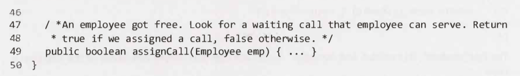

# Object-Oriented Design - Questions

## Interview Questions

---

### Question 1

#### Question

#### Hints

Hint #153

Hint #275

#### Solution

Key points

- N/A

Full solution

Additional notes

- N/A

---

### Question 1

#### Question

#### Hints

Hint #363

#### Solution

Key points

- N/A

Full solution

Additional notes

- N/A

---