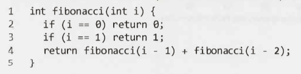
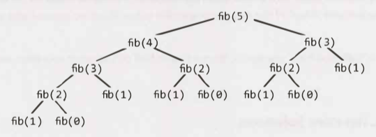
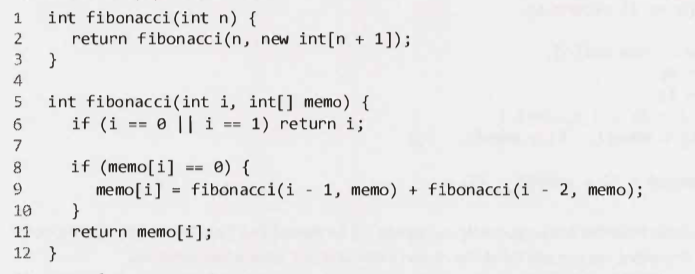
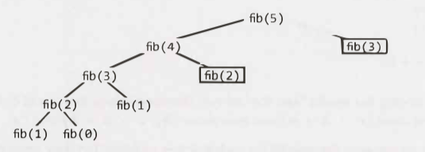
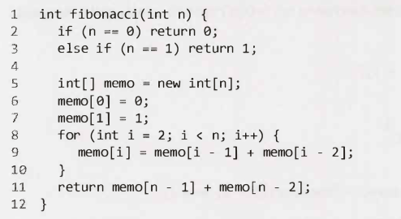
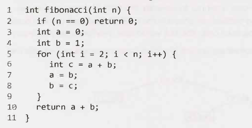

# Recursion and Dynamic Programming - Main

---

- __(*) Recursion and dynamic programming.__
- __(1) What is a good hint that a problem is recursive?__
- __(2) Give three examples of how a question, that is a good candidate for recursion, might start?__

- (1) If it can be built off of subproblems.
- (2)
    - "Design an algorithm to compute the nth ..."
    - "Write code to list the first n ..."
    - "Implement a method to compute all ..."

---

## How to Approach

---

- __(*) Recursion and dynamic programming.__
- __(1) What are recursive solutions built off of?__
- __(2) What are the 3 most common approaches to develop a recursive solution?__

- (1) Solutions to subproblems.
- (2)
    - Bottom-up.
    - Top-down.
    - Half-and-Half.

---

### Bottom-Up Approach

---

- __(*) Recursion and dynamic programming.__
- __(1) In the bottom-up approach, how do you start looking for a solution?__
- __(2) And then how do you continue?__

- (1) Try to solve the problem with only one element.
- (2) Try to solve the problem with increasing numbers of elements.

---

### Top-Down Approach

---

- __(*) Recursion and dynamic programming.__
- __(1) In the top-down approach, how do you start looking for a solution?__

- (1) You think about how you can divide the problem, for case N, into subproblems.

---

### Half-and-Half Approach

---

- __(*) Recursion and dynamic programming.__
- __(1) What is the principle behind the half-and-half approach?__
- __(2) Give two examples.__

- (1) To divide or merge(the data set).
- (2)
    - Binary search (divide).
    - Merge sort (merge).

---

## Recursive vs. Iterative Solutions

---

- __(*) Recursion and dynamic programming.__
- __(1) What is a problem with recursive algorithms?__
- __(2) Detail.__

- (1) They can be very space inefficient.
- (2)
    - Each recursive call adds a new layer to the stack.
    - If the algorithm recurses to a depth of `n`, it uses at least `O(n)` memory.

---

- __(*) Recursion and dynamic programming.__
- __(1) What is an alternative to a recursive implementation?__
- __(2) Can this alternative be used for all recursive implementations?__
- __(3) What is the problem with this alternative?__

- (1) An iterative implementation.
- (2) Yes.
- (3) Sometimes the iterative implementation is much more complex.

---

- __(*) Recursion and dynamic programming.__
- __(1) What should you do before starting to create a recursive solution?__
- __(2) Who should you discuss this with?__

- (1) Ask how hard it would be to implement an iterative solution.
- (2) The interviewer. Discuss the trade-offs.

---

## Dynamic Programming & Memoization

---

- __(*) Dynamic programming & memoization.__
- __(1) What is dynamic programming? 2 points.__

- (1)
    - Dynamic programming is (mostly) taking a recursive algorithm, finding the overlapping subproblems and then caching the results to those subproblems for future recursive calls.
        - The overlapping subproblems are the repeated calls.
    - Also taking a recursive solution and converting it to an iterative solution is dynamic programming as you end up "caching" previous work.

---

- __(*) Dynamic programming & memoization.__
- __(1) What is memoization?__

- (1)
    - Dynamic programming can be done in a top-down or a bottom-up approach.
    - Sometimes people call the top-down approach "memoization" (and the bottom-up approach as regular dynamic programming).

---

### Fibonacci Numbers

---

- __(*) Dynamic programming & memoization.__
- __(1) Code a method that calculates the `nth` Fibonacci number.__

- 

---

- __(*) Dynamic programming & memoization - Fibonacci number.__
- 
- __(1) What is the time complexity of this method? Break this question down as follows:=.__
    - __(a) Draw the code path as a tree (a recursive call tree).__
    - __(b) What do you note about all the leaf nodes?__
    - __(C) How much work is done (complexity) for each call of this function? Exclude recursive calls.__
    - __(d) What will the runtime of the method be?__
    - __(e) How many nodes are there in the tree (generally)?__
    - __(f) So what is the time complexity of this method?__
    - __(f) Is this completely correct?__
    - __(g) What type of runtime should be expect as `n` get larger?__

- (1)
    - (a)
        - 
    - (b) The leaves are all `fib(1)` and `fib(0)`.
    - (c) `O(1)`.
    - (d) Number of node x `O(1)`.
    - (e) `2^n` as each node (generally has) 2 children.
    - (f) `O(2^n)`
    - (f) No as each right subtree is smaller than the right.
    - (g) An exponentially increasing runtime.

---

#### Top-Down Dynamic Programming (or Memoization)

---

- __(*) Dynamic programming & memoization.__
- __Recursion call tree of a regular Fibonacci method:__
    - 
- __(1) What do you notice about this tree?__
- __(2) What is the problem with this?__
- __(3) What is a solution to this?__
- __(4) What is the name for this type of solution / optimisation?__

- (1) There are a number of identical nodes (e.g. `fib(2)` & `fib(3)`).
- (2) These nodes are being calculated from scratch each time.
- (3) The `fib(i)` of a node, `i`, should be cached and made available to be used later.
- (4) Top-down dynamic programming or memoization.

---

- __(*) Dynamic programming & memoization.__
- __(1) Write the code for a Fibonacci method that takes advantage of top-down dynamic programming (/ memoization).__
- __(2) Draw the recursion call tree of this method.__
- __(3) What is the time complexity of this method (aka runtime)?__

- (1)
    - 
- (3)
    - 
- (3) `O(2n)` => `O(n)`.

---

- Skipped:
    - Alternative recursion call tree (that is not accurate).

---

#### Bottom-Up Dynamic Programming

---

- __(*) Dynamic programming & memoization.__
- __(1) When creating a method to calculate the `nth` Fibonacci number utilising bottom-up dynamic programming, where do you start?__

- (1)
    - First compute `fib(0)` and `fib(1)` from the base cases.
    - Use those results to calculate `fib(2)`.
    - Use prior calculations to calculate subsequent Fibonacci numbers.

---

- __(*) Dynamic programming & memoization.__
- __(1) Write a method to calculate the `nth` Fibonacci number utilising bottom-up dynamic programming.__
- __(2) Simplify the previous method.__

- (1)
    - 
- (2)
    - 

---

- Additional reading: Proof by Induction (pg 631).

---