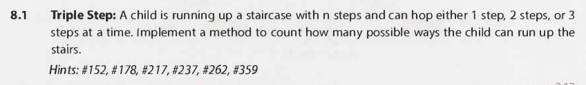

# Recursion and Dynamic Programming - Questions

## Interview Questions

---

### Question 1

#### Question

#### Hints

Hint #152

Hint #178

Hint #217

Hint #237

Hint #262

Hint #359

#### Solution

Key points

- N/A

Full solution

Additional notes

- N/A

---

### Question 2

#### Question

#### Hints

Hint #331

Hint #360

Hint #388

#### Solution

Key points

- N/A

Full solution

Additional notes

- N/A

---