# Sorting and Searching - Main

---

## Section

---

- __(*) Sorting and searching.__
- __(1) What are two interesting bits of knowledge in the following question?__
    - __Given a very large array of `Person` objects, sort the people in increasing order of age.__
- __(2) What would be a good sorting algorithm for this question?__
- __(3) What would be the time complexity of the above sorting algorithm?__

- (1)
    - It's a large array, so efficiency is very important.
    - We are sorting based on ages, so we know the values are in a small range.
- (2) Bucket sort (or radix sort).
- (3) `O(n)`.

---

## Common Sorting Algorithms

---

- __(*) Sorting and searching.__
- __(1) Memory aid for the common sorting algorithms.__
- __(2) Name the common sorting algorithms.__

- (1) **Quick**ly **select** some **bubble**s to **merge** so that they have one **radix**.
- (2)
    - Bubble sort.
    - Selection sort.
    - Merge sort.
    - Quick sort.
    - Radix sort.

---

### Bubble Sort

---

- __(*) Common sorting algorithms.__
- __(1) Detail the bubble sort.__
- __(2) What is the average and worst case time complexity (runtime) of the bubble sort?__
- __(3) What is the space complexity (memory) of the bubble sort?__

- (1)
    - 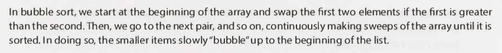
- (2) `O(n^2)`.
- (3) `O(1)`.

---

### Selection Sort

---

- __(*) Common sorting algorithms.__
- __(1) Detail the selection sort.__
- __(2) What is the average and worst case time complexity (runtime) of the selection sort?__
- __(3) What is the space complexity (memory) of the selection sort?__

- (1)
    - 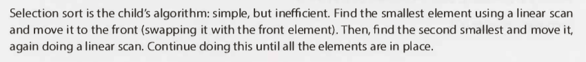
- (2) `O(n^2)`.
- (3) `O(1)`.

---

### Merge Sort

---

- __(*) Common sorting algorithms.__
- __(1) Detail the merge sort.__
- __(2) Code the merge sort.__
- __(3) Why are only the remaining elements in the left half of the helper array copied into the target array?__
- __(4) What is the average and worst case time complexity (runtime) of the merge sort?__
- __(5) What is the space complexity (memory) of the merge sort?__

- (1)
    - 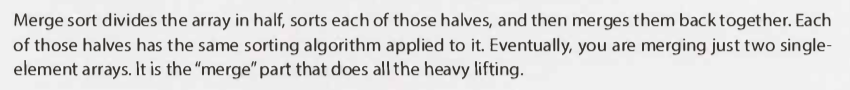
    - 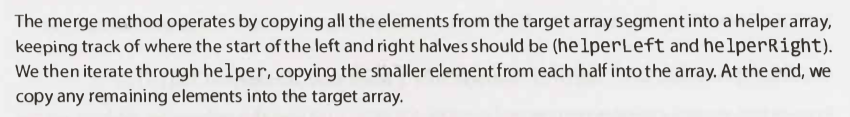
- (2)
    - 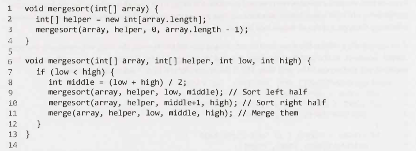
    - 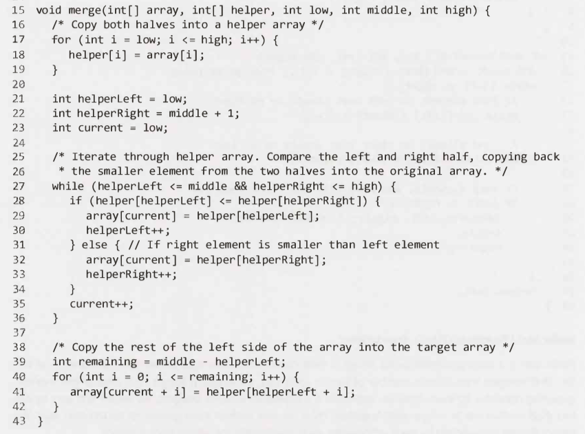
- (3)
    - The right half doesn't need to be copied because it's already there.
    - 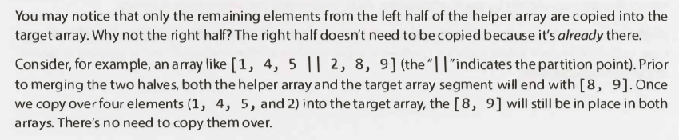
- (4) `O(n log(n))`
- (5) Depends, but in the above example `O(n)` due to the auxiliary space used to merge parts of the array.

---

### Quick Sort

---

- __(*) Common sorting algorithms.__
- __(1) Detail the quick sort.__
- __(2) Code the quick sort.__
- __(3) What is the average and worst case time complexity (runtime) of the quick sort?__
- __(4) What is the space complexity (memory) of the quick sort?__

- (1)
    - 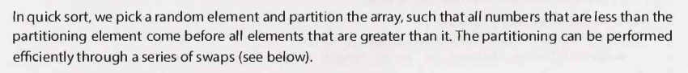
- (2)
    - 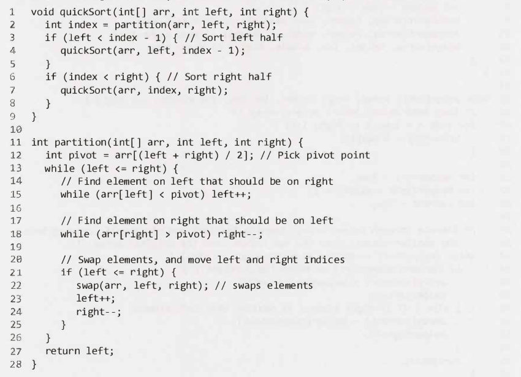
- (3)
    - Time complexity - Average: `O(n log(n))`.
    - Time complexity - Worst: `O(n^2)`.
        - 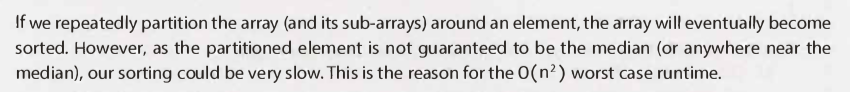
- (4)
    - `O(log(n))`
 

---

### Radix Sort

---

- __(*) Common sorting algorithms.__
- __(1) Detail the radix sort.__
- __(2) What is the average and worst case time complexity (runtime) of the radix sort?__

- (1)
    - 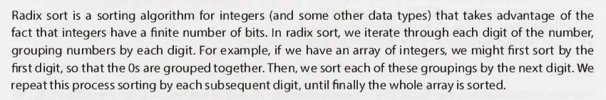
- (2)
    - `O(kn)`.
        - `n` = number of elements.
        - `k` = number of passes of the sorting algorithm.
    - 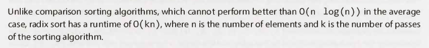
 

---

## Searching Algorithms

---

- __(*) Searching algorithms.__
- __(1) Detail the binary search.__
- __(2) When you implement the binary search, what should you be careful of?__
- __(3) Code the binary search.__

- (1)
    - 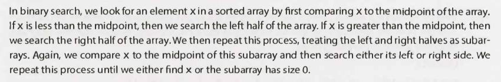
- (2)
    - 
- (3)
    - 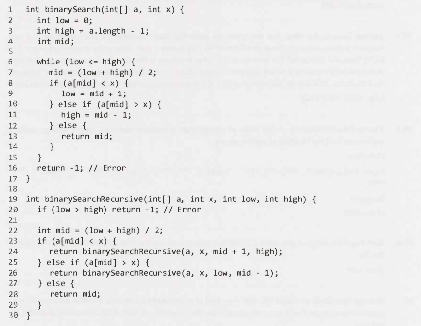

---

- __(*) Searching algorithms.__
- __(1) What are two alternative suggestions to the binary search?__

- (1)
    - Search for a node by leveraging a binary tree.
    - Using a hash table.

---